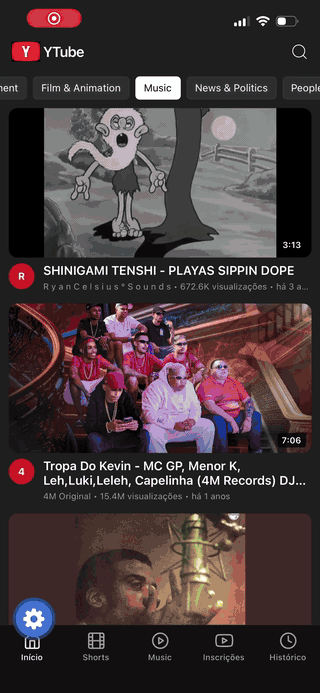
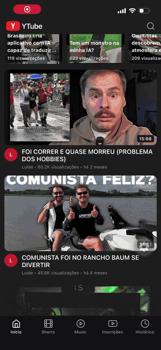

# YouTube Premium - Gratuito - auto-hospedado

Uma plataforma auto-hospedada para consumir conteúdo do YouTube sem anúncios, propagandas, algoritmos ou conteúdos gerados por IA. Inclui suporte a Vídeos, Music e Shorts, além de compatibilidade com Apple CarPlay.

O sistema sincroniza automaticamente os canais em que você está inscrito. A cada hora (intervalo configurável), verifica novos conteúdos e realiza o download completo dos itens publicados, incluindo vídeo, miniatura, descrição, metadados e outros arquivos relacionados. No caso do YouTube Music, as músicas são organizadas automaticamente por artistas, álbuns, gêneros e outros metadados, facilitando a navegação pela biblioteca.

## Demo

  
  &nbsp;&nbsp;
  

